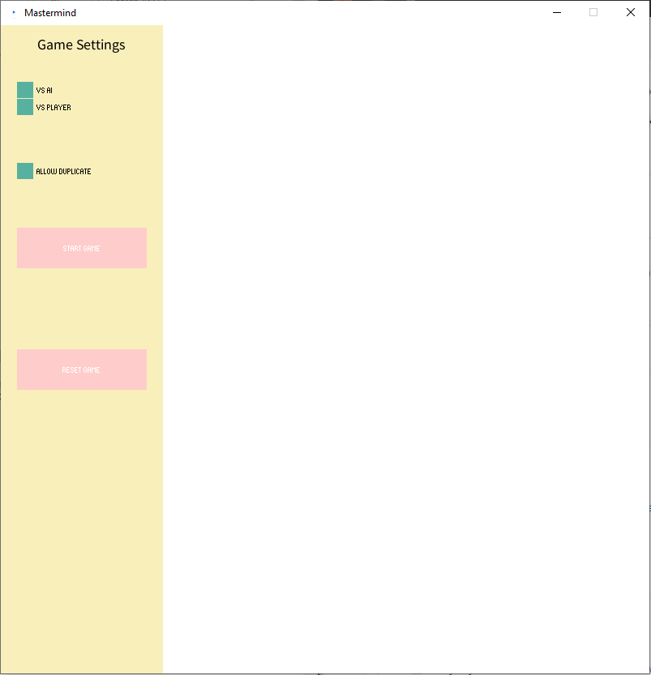

# Mastermind

Mastermind is a code-breaking game for two players. Whereby a player set up the secret code to break and the other side breaking the code.

## Documentation

This game is written in Java programing language. I've also applied some library to build my game which are:

- [ ] [Processing](https://processing.org/reference/libraries/) - To build game view
- [ ] [ControlP5](https://www.sojamo.de/libraries/controlP5/) - To build the user input functions
- [ ] [Client, Server, Thread](https://docs.oracle.com/javase/7/docs/api/java/net/package-summary.html) - To handle the Communication between Server and Client

For a complete code description check my documentation in JavaDoc : (-Code Here-)

## Installation
Clone this repository which is containing the game program. The game is named as Mastermind.java

## Set up
Before start the game, players should set up the game rules on the left side

## Authors
Author : Linda Septira Andryani
Kontakt: linda.septira.andryani@mni.thm.de

## Project status
MVC concept not assembled.
Last Modified: 12.01.2023